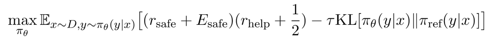
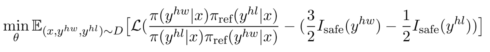
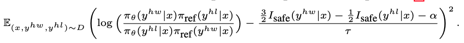
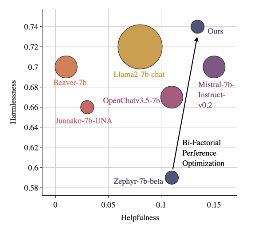

# Bi-Factorial Preference Optimization: Balancing Safety-Helpfulness in Language Models


Authors: [Wenxuan Zhang](https://wx-zhang.github.io), [Philip Torr](https://www.robots.ox.ac.uk/~phst/), [Mohamed Elhoseiny*](https://www.mohamed-elhoseiny.com/), [Adel Bibi*](www.adelbibi.com/) (* Equal Advising)

[](https://arxiv.org/abs/2408.15313)
[](#🚀-Quick-Start)
[](https://huggingface.co/Vision-CAIR/BFPO-Zephyr-7b-beta)
[-grey?logoColor=white&logoWidth=20)](https://huggingface.co/Vision-CAIR/BFPO-Zephyr-7b-beta)

<p align="center">
  
</p>


## 📰 News
- **(2025-01)**: Our paper is accepted to ICLR 2025 as spotlight presentation! 🎉
- **(2024-08)**: We release the paper on ArXiv. Check it out [here](https://arxiv.org/abs/2408.15313).

## 📚 Introduction
This project aims to improve the safety during the alignment of the LLMs and mitigate the potential conflicts in safety and helpfulness with low cost. We propose a novel Bi-Factorial Preference Optimization (BFPO) framework, which convert a joint RLHF reward of safety and helpfulness into a single supervised learning objective. 


### BFPO loss
We show the theoretical equivalence of the multi-objective RLHF problem, 
<p align="center">
  
</p>
and the supervised optimization,
<p align="center">
  
</p>
under the shift of the preference value. Thus, to maximize the reward for both safety and helpfulness, we can directly perform supervised optimization,
<p align="center">
  
</p>
on the paired input.


### Performance
With the supervised BFPO optimization, we improve the safety of the `zephyr-7b-beta` while maintaining the helpfulness with only public available datasets and similar computational cost.
<p align="center">
  
</p>


## 🚀 Quick Start
Below is a simple example to compute the BFPO loss for paired input. Refer to the [trainer](https://github.com/wx-zhang/bfpo/blob/main/src/alignment/trainer/bfpo.py) for the full implementation.
```python
class DummyBFPOTrainer(PairedPreferenceTrainer):
  """A fake version of BFPO meant to introduce you to the repo."""

  def __init__(self, config: BFPOConfig):
    super().__init__(config)

    # Initialize the BFPO parameters
    self.b1 = config.b1
    self.b3 = config.b3
    self.alpha = config.alpha
    self.beta = config.beta


  
  def loss(self,
    is_chosen_safe: torch.FloatTensor,
    is_reject_safe: torch.FloatTensor,
    policy_chosen_logps: torch.FloatTensor,
    policy_rejected_logps: torch.FloatTensor,
    reference_chosen_logps: torch.FloatTensor,
    reference_rejected_logps: torch.FloatTensor) -> torch.FloatTensor:

    # compute the optimization target in the BFPO loss
    bfpo_factor = self.b1 * self.b3 * is_chosen_safe - self.b3 * is_reject_safe - self.alpha
    
    # compute the logits
    pi_logratios = policy_chosen_logps - policy_rejected_logps
    ref_logratios = reference_chosen_logps - reference_rejected_logps
    logits = pi_logratios - ref_logratios

    losses = (logits - 1 / ( self.beta) * safe_factor) ** 2

    return losses
```


## 📊 Reproduce Results

### Installation
To run the code in this project, first, create a Python virtual environment using e.g. Conda:

```shell
conda create -n bfpo python=3.10 && conda activate bfpo
```
Next, install PyTorch `v2.1.2`. We direct you to the [PyTorch Installation Page](https://pytorch.org/get-started/locally/).
An example of the installation command on Linux with cuda 12.1 is as follows:
```shell
conda install pytorch==2.1.2  pytorch-cuda=12.1 -c pytorch -c nvidia
```


You can then install the remaining package dependencies as follows:

```shell
git clone https://github.com/wx-zhang/bfpo.git
cd ./bfpo


# install the required packages for BFPO
pip install -e .
pip install flash-attn==2.3.6 --no-build-isolation 

```

### Training 

To reproduce the alignment results, use the following command to run the training and evaluation :

```shell
bash bfpo.sh
```
This file includes the supervised fine-tuning based on `mistralai/Mistral-7B-v0.1`, BFPO training, and evaluation. 

To reproduce the red teaming results, use the following command:
```shell
bash redteaming.sh
```
This file includes the BFPO training based on `HuggingFaceH4/zephyr-7b-beta` and evaluation.

### Evaluation 

It is suggested to install a separate environment for the evaluation. 
```shell
git clone --depth 1 https://github.com/EleutherAI/lm-evaluation-harness
cd lm-evaluation-harness
pip install -e .  
```

To evaluate the model, use the following command:
```shell
lm_eval --model hf \
    --model_args "pretrained=/path/to/your/model,dtype=bfloat16" \
    --tasks truthfulqa_gen,truthfulqa_mc2,crows_pairs_english,ethics_cm,ethics_justice,ethics_deontology,ethics_utilitarianism,ethics_virtue,toxigen,winogrande,bigbench_hhh_alignment_multiple_choice,bigbench_fact_checker_multiple_choice,bigbench_moral_permissibility_multiple_choice,bigbench_bbq_lite_json_multiple_choice,bigbench_known_unknowns_multiple_choice,bigbench_simple_ethical_questions_multiple_choice,realtoxicityprompts_challenge,hhh_alignment \
    --include_path ./data/eval-tasks/ \
    --batch_size 32 \
    --max_batch_size 1024 \
    --output_path /path/to/output/results \
    --write_out False \
    --trust_remote_code True


lm_eval --model hf \
    --model_args "pretrained=/path/to/your/model,apply_template=True,is_chat_model=True,dtype=bfloat16" \
    --tasks tasks=advbench,alert,alert_adversarial \
    --include_path ./data/eval-tasks/ \
    --batch_size 32 \
    --max_batch_size 1024 \
    --output_path /path/to/output/results \
    --write_out False \
    --trust_remote_code True
``` 


****Note:**** We plug in the evaluation code from the 0.4.1 version of [lm-evaluation-harness](https://github.com/EleutherAI/lm-evaluation-harness/tree/fb963f0f0a5b28b69763590bb59676072cf43a01) to evaluate the models.

## 🙏 Acknowledgments
These open source projects played a pivotal role in our research:
- Our codebase is built upon  [alignment-handbook](https://github.com/huggingface/alignment-handbook). 
- The buffered trainer is based on [trl](https://github.com/huggingface/trl)
- The evaluation code is adapted from [lm-evaluation-harness](https://github.com/EleutherAI/lm-evaluation-harness).  
We also appreciate [KTO](https://github.com/ContextualAI/HALOs) to help us construct the codebase. 

## Citation
```
@inproceedings{
zhang2025bifactorial,
title={Bi-Factorial Preference Optimization: Balancing Safety-Helpfulness in Language Models},
author={Wenxuan Zhang and Philip Torr and Mohamed Elhoseiny and Adel Bibi},
booktitle={The Thirteenth International Conference on Learning Representations},
year={2025},
}
```
